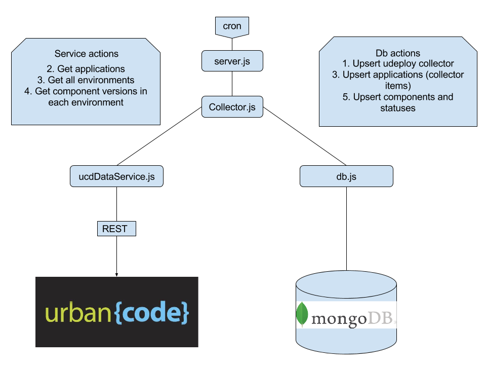

        
* v6.2.1
        
* v5.4.1

This is a simple collector urban code deploy. To use:

        npm install --production
        node server.js
        
        
 To develop, use in dev mode. 
        
        npm install 
        node server.js
        
        
 
        
